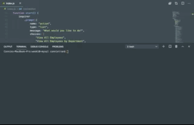

# MySQL Employee Tracker

This command-line interface is a Node MySQL application that allows users to view and interact with information stored in a database that houses employee, company, and department data. 

## Functionality

This Node command-line application allows the user to:

  * View departments, roles, employees

  * View employees by department or by manager

  * Add departments, roles, employees

  * Delete departments, roles, and employees

  * Update employee roles

  * Update employee managers

## Installation

To run this application, first download the repository and run `npm install` in order to install the following npm package dependencies as specified in the [`package.json`](https://github.com/connietran-dev/mysql-employee-tracker/blob/master/package.json):

* [MySQL](https://www.npmjs.com/package/mysql) NPM package to connect to the MySQL database and perform queries.

* [InquirerJs](https://www.npmjs.com/package/inquirer/v/0.2.3) NPM package to interact with the user via the command-line.

You may wish to run `db/schema.sql` and `/db/seeds.sql` files to create the database locally. 

The [`utils/`](https://github.com/connietran-dev/mysql-employee-tracker/tree/master/utils) folder contains separate files for functions for performing specific SQL queries, including a variety of SQL `JOIN`s.

## Database Schema

The `schema.sql` file in the `db/` folder creates the following database schema containing three tables:

* **department**:

  * **id** - INT PRIMARY KEY
  * **name** - VARCHAR(30) to hold department name

* **role**:

  * **id** - INT PRIMARY KEY
  * **title** -  VARCHAR(30) to hold role title
  * **salary** -  DECIMAL to hold role salary
  * **department_id** -  INT to hold reference to department role belongs to

* **employee**:

  * **id** - INT PRIMARY KEY
  * **first_name** - VARCHAR(30) to hold employee first name
  * **last_name** - VARCHAR(30) to hold employee last name
  * **role_id** - INT to hold reference to role employee has
  * **manager_id** - INT to hold reference to another employee that manager of the current employee. This field may be null if the employee has no manager

The `seeds.sql` file can be run to pre-populate your database from our favorite characters from The Office.

### Future Enhancements

If time permits, there are some future enhancements, minor tweaks, and improvements I'd like to make:

* Refactor database queries with async/await and Promises
* Utilize an NPM package for console.table
* Enhance logic and functionality to further update employee data